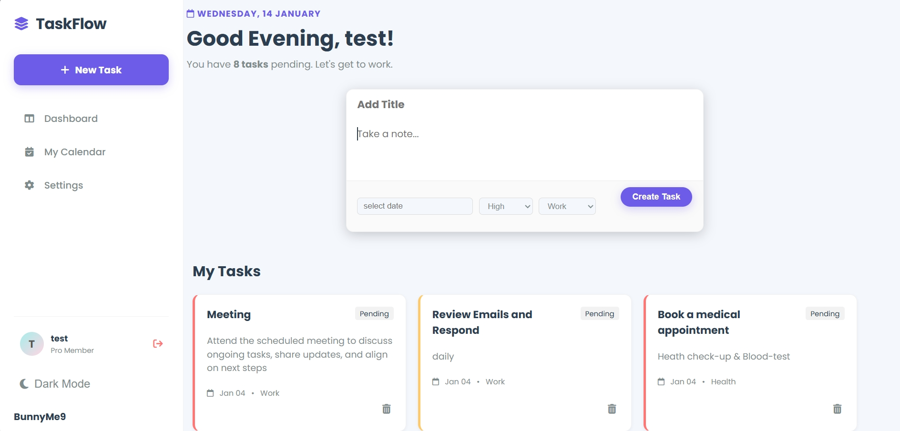
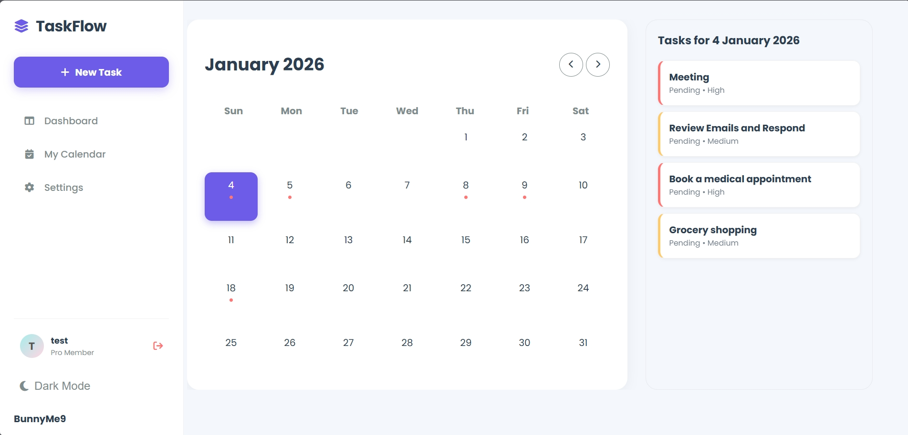

# TaskFlow 🚀


**TaskFlow** is a robust, industry-standard task management application built with Python and Flask. Unlike simple tutorial apps, TaskFlow is engineered with a **scalable Application Factory architecture**, separating concerns via **Blueprints** to ensure code maintainability and modularity.

---

## 📸 Interface Gallery

| Dashboard View | Settings | Calendar |
|:---:|:---:|:---:|
|  |  |  |


---

## ◻️ Key Features

* **🔐 Secure Authentication:** User registration and login utilizing `Werkzeug` security hashing and `Flask-Login` for session management.
* **📂 Modular Architecture:** Built using the **Application Factory Pattern** and **Blueprints**, preventing circular imports and allowing easy scalability.
* **🗄️ Database Migrations:** Integrated `Flask-Migrate` (Alembic) to handle database schema changes without data loss.
* **✅ Task Management:** Create, Read, Update, and Delete (CRUD) tasks with attributes like Priority (High/Medium/Low), Categories, and Due Dates.
* **🔌 JSON API:** dedicated `/api/tasks` endpoint serving data for potential frontend frameworks or mobile apps.
* **🛡️ Form Validation:** Robust input validation using `Flask-WTF` to prevent invalid data submission.

---

## 🛠️ Technical Structure

The project follows a professional directory structure to separate business logic, database models, and routing:

```text
task_manager/
│
├── run.py                 # Application Entry Point
├── migrations/            # Database Migrations folder
├── instance/              # SQLite Database storage
│
└── app/                   # Main Application Package
    ├── __init__.py        # App Factory & Extension Init
    ├── extensions.py      # SQLAlchemy & LoginManager instances
    ├── models.py          # Database Models (User, Tasks)
    ├── forms.py           # WTForms Definitions
    │
    ├── auth/              # Authentication Blueprint
    │   └── routes.py      # Login/Register Logic
    │
    └── main/              # Core Application Blueprint
        └── routes.py      # Dashboard, API, Settings Logic
```
---
🗺️ Roadmap
We are constantly improving TaskFlow. Here is what is coming next:

* **Email Verification:** Implement token-based email confirmation for authentic user accounts.

* **Task Search & Filter:** Dynamic filtering by Priority and Category.

* **Drag & Drop:** Interactive UI to reorder tasks or move them between statuses.

---
* Author: <a href="https://github.com/sanheeth-singh"> <strong> Sanheeth singh </strong></a>
* Linkedin: <a href="www.linkedin.com/in/sanheethsingh">SanheethSingh</a>
